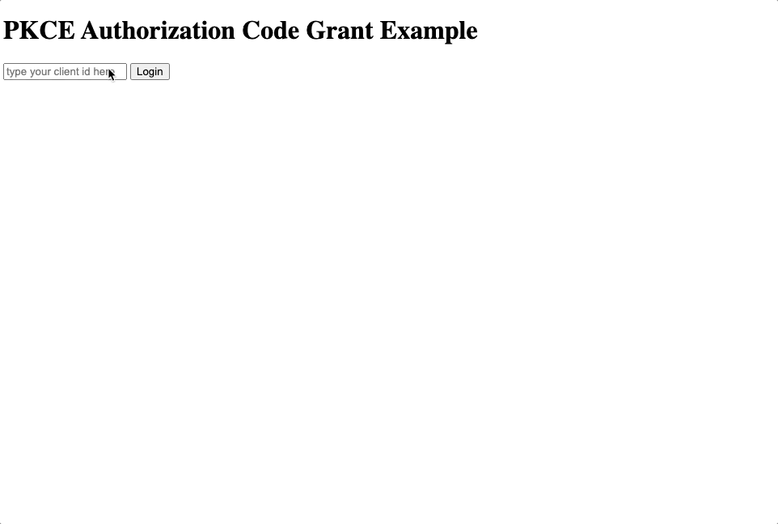

# PCKE client-side only

## Introduction

The purpose of this sample is demonstrate a quick way to test and obtain your three legged tokens using PKCE method in the context of a single page app (you can refer [here](https://aps.autodesk.com/en/docs/oauth/v2/tutorials/get-3-legged-token-pkce/) for more details).

## Why PKCE?

As said by [Petr Broz](https://github.com/petrbroz) in [this blog post](https://aps.autodesk.com/blog/new-application-types):

> This option is recommended for scenarios where your application is running natively on a desktop or a mobile device, in other words, for scenarios where you cannot protect your app's credentials. This application type uses Proof Key for Code Exchange (PKCE) for increased security.

The blog also covers a basic snippet that you can use to generate a token with this flow.
With only a few modifications we can make a simple app hosted in [github pages](https://pages.github.com) so you can better understand how it works (and generate your own tokens for testing).

## How it works?

To do that in a single page app without server side, we need no handle the steps below:

If we use the [localStorage](https://developer.mozilla.org/en-US/docs/Web/API/Window/localStorage) to store the client id and the code verifier, we can manage the 3LO token acquisition from our app.

## Pre-requisite

If you wanna give it a try, you just need to add `https://autodesk-platform-services.github.io/aps-pkce-webapp` as a callback option in your APS app and click save, just like in the image below:

And with that you're able to obtain a valid token through this sample app.

Also, as long as you have this app [provisioned in your hub](https://tutorials.autodesk.io/#provision-access-in-other-products), this token can be used to view the contents you have access to.

## Retrieving your token

Now you just need to type your client id at https://autodesk-platform-services.github.io/aps-pkce-webap and start the process to get your token.

## License

This sample is licensed under the terms of the [MIT License](http://opensource.org/licenses/MIT). Please see the [LICENSE](LICENSE) file for full details.

## Written by

João Martins [@JooPaulodeOrne2](http://twitter.com/JooPaulodeOrne2), [Developer Advocate](http://aps.autodesk.com)
